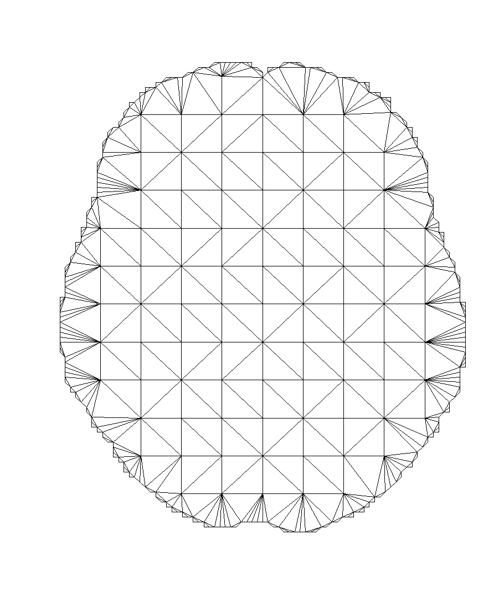
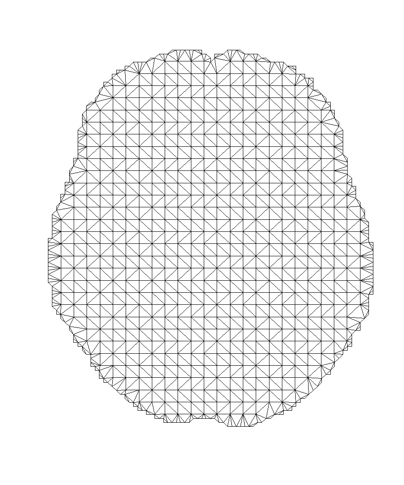
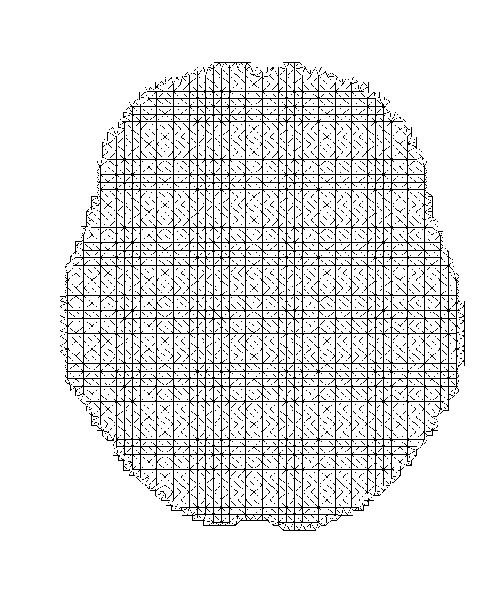
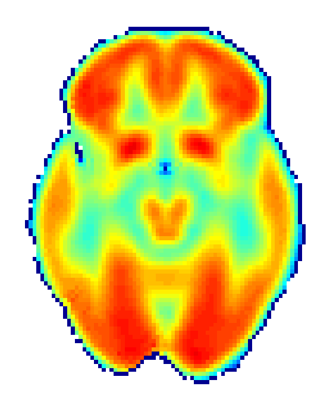
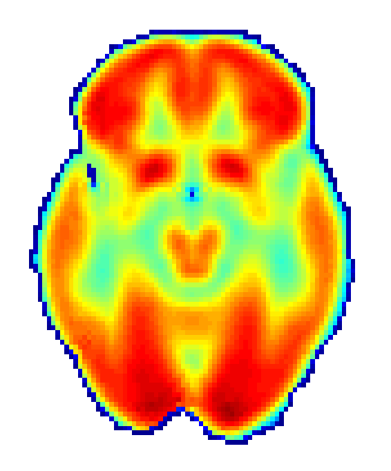

# Functional Data Analysis for Imaging Mean Function Estimation: Computing Times and Parameter Selection

This repository contains all the code used in our article:

Arias-López, J. A., Cadarso-Suárez, C., & Aguiar-Fernández, P. (2022). Functional Data Analysis for Imaging Mean Function Estimation: Computing Times and Parameter Selection. *Computers*, 11(6):91. https://doi.org/10.3390/computers11060091

The analysis was performed entirely in R, with scripts organized in two ways for your convenience:
- A complete MASTERSCRIPT that runs the entire analysis
- Individual task-specific scripts that combined equal the MASTERSCRIPT

Feel free to use this code to replicate our results or adapt it for your own research. Long live open science!

## Brain Triangulations

N10 | N25 | N50
:-------------------------:|:-------------------------:|:-------------------------:
 |  | 

## Simultaneous Confidence Corridor Estimation

Lower Interval | Mean Function | Upper Interval
:-------------------------:|:-------------------------:|:-------------------------:
 |  | 